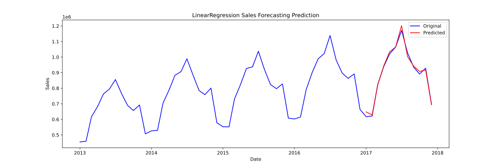
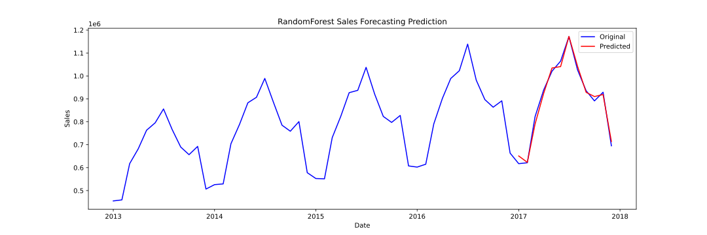
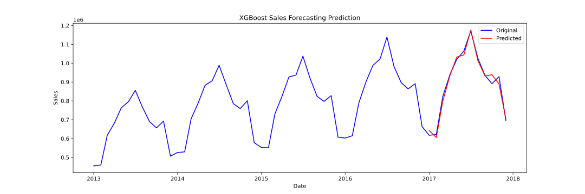

# 📈 Sales Forecasting Using Regression Models

This project demonstrates time-series sales forecasting using classical **regression models** — **Linear Regression**, **Random Forest**, and **XGBoost** — built in a clear, well-documented Jupyter notebook. The goal is to produce accurate, interpretable forecasts without relying on deep learning (LSTM) or statistical models (ARIMA).

---

## 📌 Overview

- Forecast future sales using supervised machine learning
- Focus on interpretable and fast regression models
- Visual comparison of actual vs. predicted sales
- Exportable forecast charts for presentations or reports

---

## 🔍 Exploratory Data Analysis (EDA)

- Analyzed seasonality, trends, and store/item-level behavior  
- Identified missing values, sales distribution, and outliers  
- Generated lag features and date-derived components (month, year, etc.)  
- Used ACF/PACF plots to examine autocorrelation structure

---

## 🤖 Models Used

1. **Linear Regression**
2. **Random Forest Regressor**
3. **XGBoost Regressor**

Each model is evaluated using:
- MAE (Mean Absolute Error)
- MSE (Mean Squared Error)
- RMSE (Root Mean Squared Error)

---

## 📊 Forecast Results

### 🔵 Linear Regression

---

### 🌲 Random Forest

---

### ⚡ XGBoost

---

## 📁 Dataset Source

> The dataset used is a cleaned retail sales time-series dataset.  
> Source: [Kaggle - Demand Forecasting](https://www.kaggle.com/c/demand-forecasting-kernels-only)  

---

## 🚀 How to Run

1. Clone the repo  
2. Install dependencies  
3. Run the Jupyter notebook

---

## 👤 Author

**Harsh Soni**  
🔗 [GitHub](https://github.com/yourusername)

---
